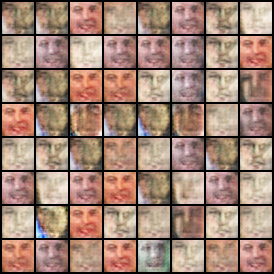
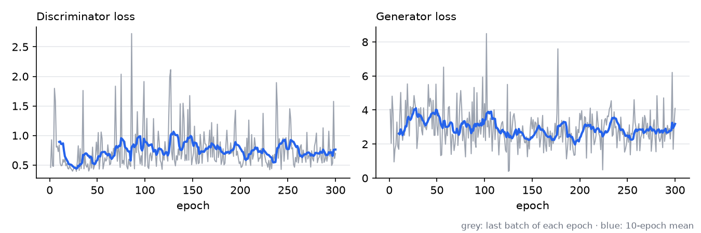
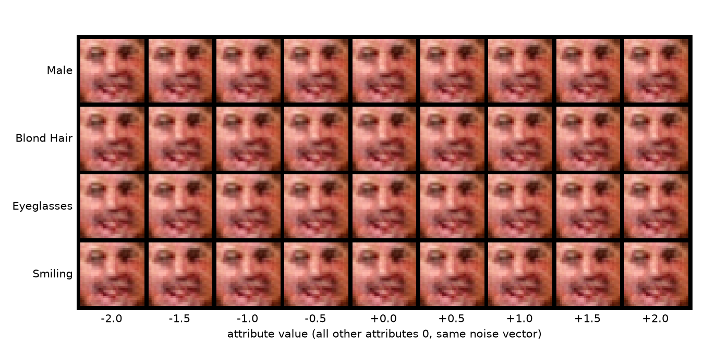

# Conditional GAN on LFWCrop Face Attributes

A conditional GAN in PyTorch that generates 32×32 faces from noise plus 36 facial attributes from the LFW attribute set (*Male*, *Smiling*, *Eyeglasses*, *Blond Hair* and 32 more). The goal was to change one attribute and watch the face change with it. A 2026 re-run shows the generator learned faces but mostly ignores the attributes; the numbers are below.

## How the conditioning works

The attributes are the continuous scores from LFW's `lfw_attributes.txt` (for example *Male* = 1.0, *Smiling* = −0.02), so they go into both networks as raw values. A one-hot embedding would only fit discrete classes. The `nn.Embedding` in the generator is a leftover and is never called.

- **Generator**: the 100-d noise vector goes through transposed and regular convolutions to a 128×7×7 feature map. That map is flattened and concatenated with the 36 attribute values. The result is treated as a 1×1 image with 6,308 channels, and four transposed convolutions with batch norm bring it up to 3×32×32 (tanh output).
- **Discriminator**: six convolutions (LeakyReLU, batch norm, dropout 0.5 on three of them) reduce the image to 256×4×4. The flattened features are concatenated with the attributes and go through three linear layers and a sigmoid.
- **Training**:
  - Loss is binary cross-entropy.
  - Both networks use SGD (lr 2e-4, weight decay 5e-5), with momentum 0.9 for the generator and 0.7 for the discriminator.
  - Real images are labeled 0.9 instead of 1 (one-sided label smoothing).
  - Each fake is generated with the attribute vector of a real image from the same batch.

## Results

**2020.** The original Colab run was stopped at epoch 70 of the configured 2000. Its log is still in the notebook (D loss 0.48 → 0.37, G loss 4.29 → 3.75), but it saved no generated images.

**Reproduced in 2026.** Same notebook code and hyperparameters, with two differences: 300 epochs instead of 2000, and PyTorch 2.14 on an NVIDIA RTX A1000 laptop GPU (CUDA 12.6). The run took 100 minutes, about 19.6 s per epoch (`docs/run_2026.txt`). The figures and numbers come from `make_figures.py`.

Samples at epoch 300 (fixed noise, attributes taken from real images):



The losses stay noisy but neither network takes over:



The attribute sweep is where the project falls short. Each row keeps the same noise vector and moves one attribute from −2 to +2, with the other 35 at 0:



The rows look the same, and measuring confirms it. Mean absolute pixel difference over 256 generated images, on a 0–1 scale (`docs/conditioning_check.txt`):

| Change | Pixel difference |
|---|---|
| Different noise vector, same attributes | 0.0758 |
| *Male* −2 → +2 | 0.0068 |
| *Blond Hair* −2 → +2 | 0.0004 |
| *Eyeglasses* −2 → +2 | 0.0006 |
| *Smiling* −2 → +2 | 0.0004 |
| All 36 attributes resampled | 0.0029 |

Moving a single attribute changes the image 11 to 190 times less than changing the noise. My best guess at the cause is in the generator: the 36 attribute values are concatenated to 6,272 feature values, so they make up about 0.6% of that layer's input. Feeding them in earlier, or projecting them to a larger size first, would be the first thing to try. I haven't tested it.

## How to run

The notebook downloads the dataset itself: it clones [Antonio210696/LFWCrop_dataset_pytorch](https://github.com/Antonio210696/LFWCrop_dataset_pytorch) (13,233 cropped faces plus the attribute file, about 390 MB; 13,140 of the faces have attributes) into `lfwcrop/`.

Current stack (GPU):

```bash
py -3.13 -m venv .venv
.venv\Scripts\python -m pip install -r requirements.txt
.venv\Scripts\python -m jupyter nbconvert --to notebook --execute cgan_lfw_attributes.ipynb --output run.ipynb
.venv\Scripts\python make_figures.py run.ipynb
```

`EPOCHS` in the "Set arguments" cell is 2000, as in 2020. At the speed measured on the RTX A1000 that's about 11 hours, so lower it for a quick look. The run writes checkpoints to `output/` after every epoch, plus a sample grid every 10 epochs.

The original 2020 stack (torch 1.4.0) is pinned in `requirements-2020.txt`. It still runs a full epoch on Python 3.8, on CPU only: torch 1.4 is too old for recent NVIDIA GPUs.

## Known limitations

- Runs aren't reproducible: the data-preprocessing cell reseeds with `random.randint`, which overrides the fixed seed set earlier.
- The 2026 run stopped at 300 epochs. The conditioning might improve with the full 2000, but nothing in the loss curves points that way.
- The generator outputs tanh values in [−1, 1], while the real images stay in [0, 1] (the normalization line in the dataset transform is commented out).

## Credits

Built together with Antonio Epifani ([@Antonio210696](https://github.com/Antonio210696)) and Gianluca Amprimo. Antonio also prepared the LFWCrop dataset loader.

Data: [LFWcrop](https://conradsanderson.id.au/lfwcrop/), a cropped version of Labeled Faces in the Wild, and the [LFW attributes](http://www.cs.columbia.edu/CAVE/projects/faceverification) from Columbia University.

## Status

University group project, Politecnico di Torino, 2020. Not maintained.
